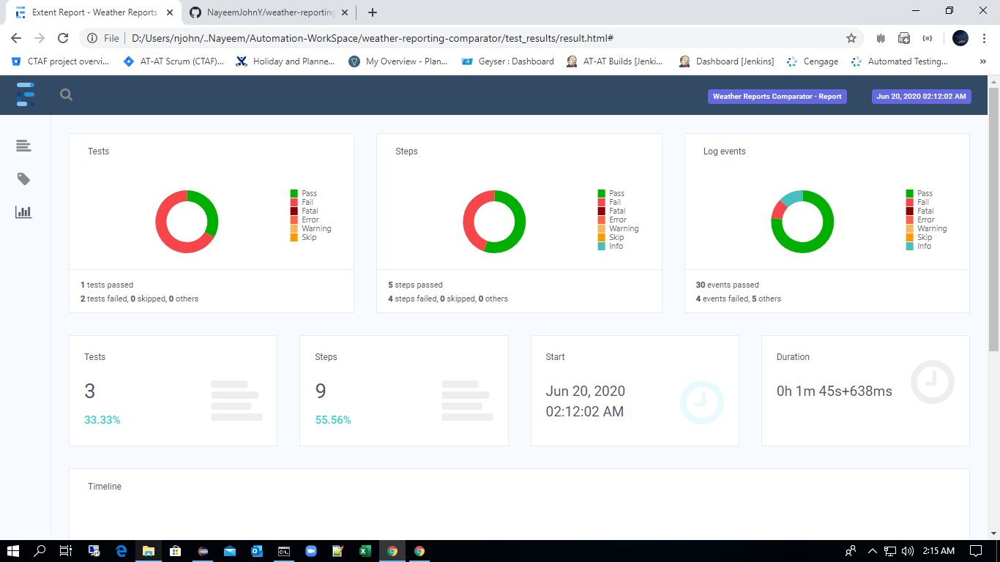

# Weather Reporting Comparator

This project is will compare weather conditions like Temperature in Degrees, Temperature in Fahrenheit and Humidity from the two sources with the allowed variance range.

##### Sources Used:

1.  **UI Source:** The [Weather](https://social.ndtv.com/static/Weather/report/?pfrom=home-topsubnavigation "NDTV Weather - Weather in your Indian City") submenu from [NDTV](https://www.ndtv.com/) website
2.  **API Source:** <https://openweathermap.org/current>

##### Some Key points about framework:

*   It builded with Maven project structure
*   It uses TestNG testing framework for Testing
*   To make API calls, It is using RestAssured
*   Reporting : Extent Reports used
*	Logger : All execution steps are logged in console & file using log4j

##### Output:

*   **HTML Extent Report**: This report will be generated after execution of all tests in current directory folder: test_results/result.html
*   **Loggers**: To know the execution steps or to debug the log file will be generated in current directory folder:target/logs/weather-reporting-comparator.txt

##### Test cases covered
Currently the below test cases are covered:
		
*   _ValidateTemperatureInDegrees_ : It compares the temperature in degrees from the sources with the temperature variance range allowed for the given city.
*   _ValidateTemperatureInFahrenheit_ : It compares the temperature in Fahrenheit from the sources with the temperature variance range allowed for the given city.
* 	_ValidateHumidity_ :It compares the humidity % value from the sources with variance allowed range.

##### Execution Steps in Local

1.  Download the **weather-reporting-comparator project** to the local
2.  Launch Terminal/Command Prompt and change directory to the project directory
3. 	To execute the test with default parameters : **mvn clean test**
4. 	To execute with the new parameters, specify all custom parameters as below
		
> **mvn clean test -DCity=${cityName} -DTemperature_variance=${variance_value} -DHumidity_variance=${variance_value} -DTestCasesToRun=${TestCaseNames}**

The All parameters are optional, if any parameters are not specified, The default values will be taken from the **GlobalTestProperties.properties file**

	${cityName}= City name with comma(,) separated. eg:City=Bengaluru,Chennai,Mumbai or City=NewDelhi [Single or multiple cities]
	
	${variance_value}= variance range must be decimal value eg:2, 10.8, 12.7888
	
	DTestCasesToRun = To run all only the specified tests , pass the test name to this property. TO Run all the tests, should not specify this property

##### Extent HTML Report
After Run is completed, the HTML report can be found in the test_reusults folder which have the summary of test execution

###### Screenshot of Reports:

 

